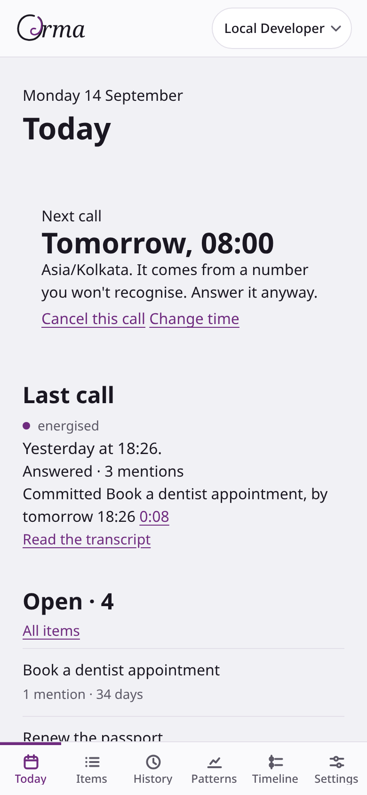
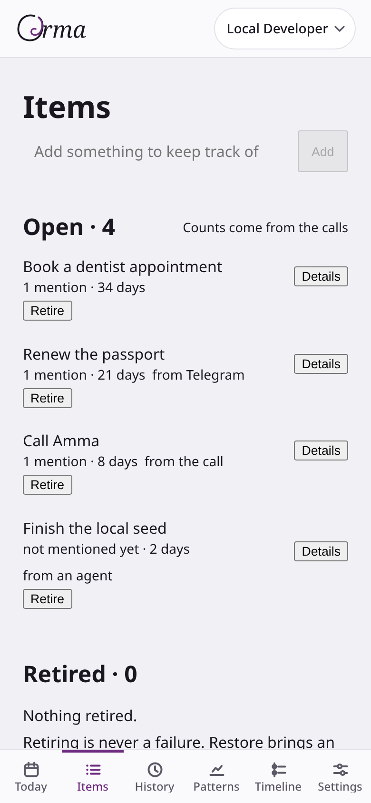
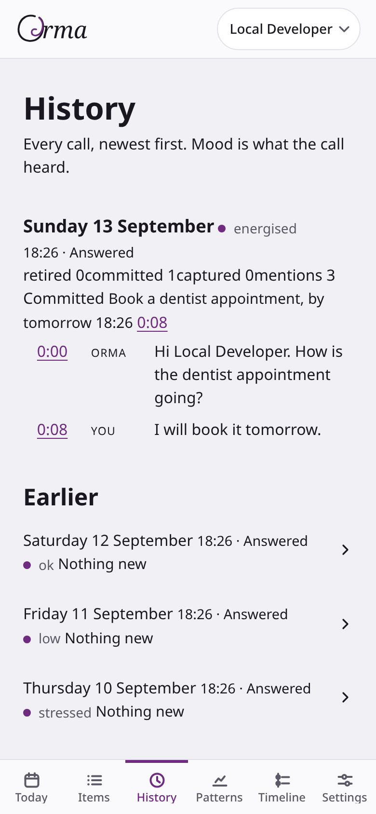
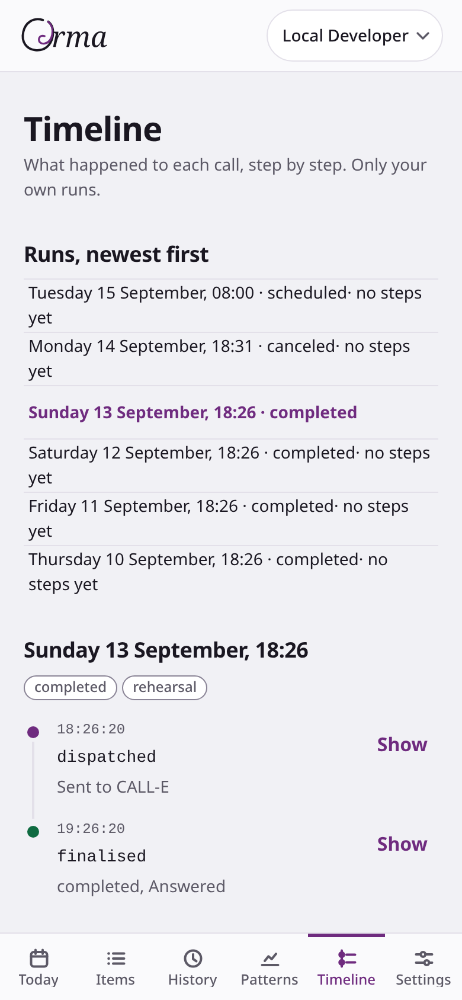
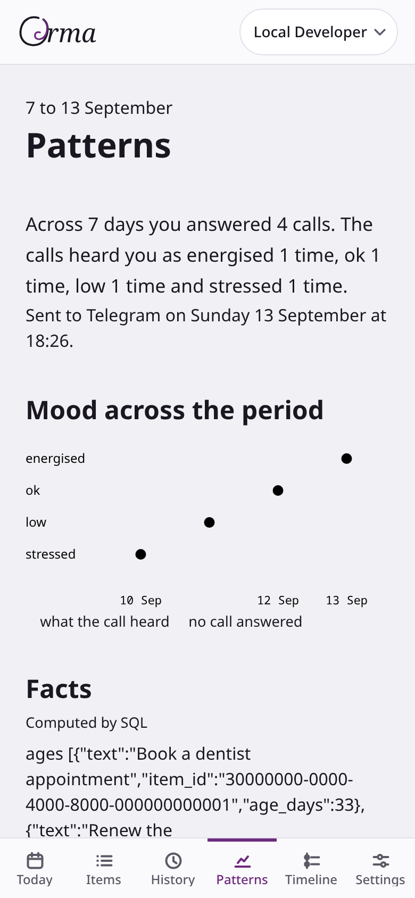
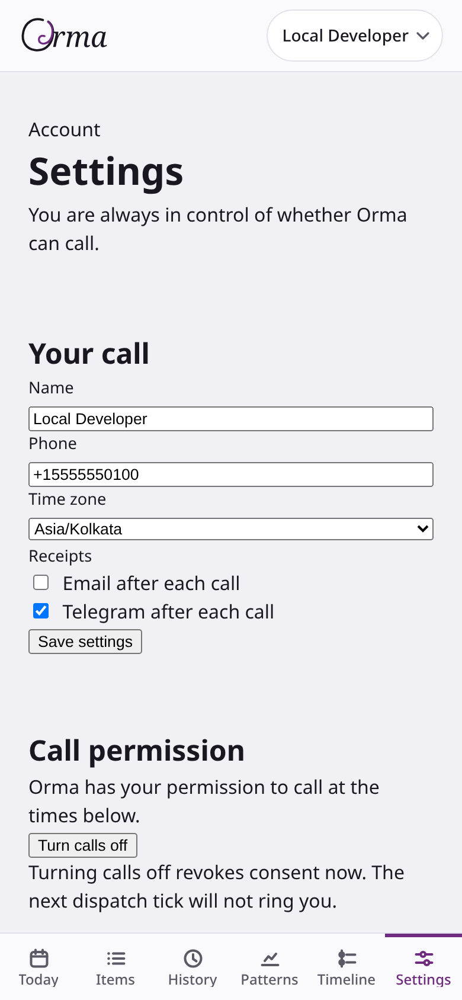
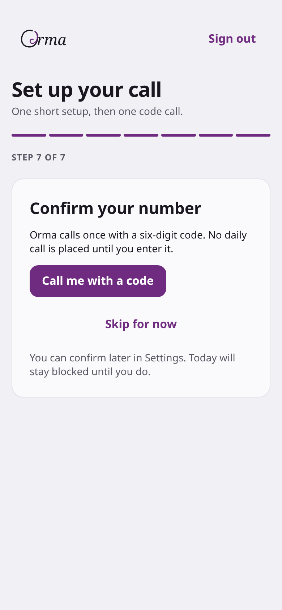

<p align="center">
  <picture>
    <source media="(prefers-color-scheme: dark)" srcset="docs/screens/orma-wordmark-dark.svg">
    <source media="(prefers-color-scheme: light)" srcset="docs/screens/orma-wordmark-light.svg">
    
  </picture>
</p>

<p align="center">
  <strong>A daily two-minute accountability call. It remembers what you keep not doing.</strong>
</p>

## What Orma is

Orma is a daily two-minute accountability call. It rings at a time you chose, leads with what you keep not doing, asks what needs capturing, and hangs up. The thesis is accountability, not reminding. An app notification gets dismissed without consequence or witness. A spoken question, asked by a machine that remembers what you said last time, carries weight. Orma treats being a known machine as an asset. You speak honestly because no human feels disappointed when you admit inaction.

## How the demo was made

The call in the demo video is a real phone call. CALL-E dials the operator's phone on a real slot, and the operator answers.

The history that the call reads is seeded data. The script `scripts/seed.ts` creates these historical rows without placing phone calls. It seeds the item "the dentist" with `seeded = true`, `source = 'call'`, and a `since_date` 34 days before the demo date. It writes three completed call runs with `dry_run = true` and `billable = false`. Each run carries a stable idempotency key under the `orma:seed:` prefix, synthetic transcript turns, and validated structured results. One `item_mentions` row per run links "the dentist" to that run's transcript offset. The seed also adds two items, "renew the passport" and "weekend groceries", so the Today screen looks natural.

When the database function `assemble_briefing` runs, SQL aggregates these rows into the briefing. The call speaks: "You've mentioned the dentist 3 times. It's been 34 days." The prompt never invents these numbers. A single query matching `seeded = true` or `orma:seed:%` identifies every seeded row.

## Try it without calling anyone

You can explore the application locally with Docker, the Supabase CLI, Node and Deno. This flow places no phone calls and spends no money.

1. Clone this repository and enter the directory:

```bash
git clone <this-repository-url> orma
cd orma
```

2. Start the local Supabase stack:

```bash
./scripts/p6-local-stack.sh up
```

The script starts a scratch Supabase stack in Docker on ports 58320 to 58329. It applies every migration, loads `supabase/seed.sql`, and inserts harness rows. It starts no edge runtime, so no function and no cron runs locally. It creates three accounts:
- `local@example.com` has call history, a pattern report and a future scheduled run.
- `firstrun@example.com` has a profile, a slot and two items, and no calls.
- `live@example.com` has one run frozen in the `awaiting_result` state.

Every harness phone number comes from the fictional 555 range.

3. Install the web dependencies and start the web app in a new terminal:

```bash
cd web
npm install
env $(../scripts/p6-local-stack.sh env) npm run dev
```

4. Sign in. The login page sends a magic link, and the local stack runs no mail server. Mint a one-time sign-in token for a harness account through the local Auth admin API instead:

```bash
SRK=$(supabase status --workdir /tmp/orma-p6-stack -o env 2>/dev/null | sed -n 's/^SERVICE_ROLE_KEY="\{0,1\}\([^"]*\)"\{0,1\}$/\1/p')
curl -sS -X POST http://127.0.0.1:58321/auth/v1/admin/generate_link \
  -H "apikey: $SRK" -H "Authorization: Bearer $SRK" -H 'Content-Type: application/json' \
  -d '{"type":"magiclink","email":"local@example.com"}' \
  | python3 -c "import json,sys; print(json.load(sys.stdin)['hashed_token'])"
```

The key stays in a shell variable and only the token prints. Open `http://localhost:5173/login/callback?token_hash=<printed token>&type=magiclink` in your browser. The token works once.

5. Browse Today, Items, History, Timeline, Patterns and Settings over the harness rows. Timeline shows each run's `call_events` step by step. Nothing advances while you watch, because no `tick` runs locally. The scheduled run stays `scheduled`, and the live account's run stays `awaiting_result`.

The harness numbers arrive already confirmed. Settings and onboarding still show the confirmation step for an unconfirmed number. "Call me with a code" cannot finish locally, though, because no `confirm-phone` function runs.

6. Optionally, preview the demo seed against the local stack. Run this from the repository root in the same shell:

```bash
ORMA_API_URL=http://127.0.0.1:58321 SUPABASE_SERVICE_ROLE_KEY="$SRK" \
  deno run --allow-env --allow-net=127.0.0.1 scripts/seed.ts --email local@example.com
```

Without a flag, the script prints its plan and the disclosure paragraph and writes nothing. Add `--apply` to write the seeded rows, and `--remove` to delete them again.

7. When finished, stop the local stack:

```bash
./scripts/p6-local-stack.sh down
```

## Architecture

Orma uses a serverless and edge architecture without persistent daemon processes.

### Cloudflare Workers

Orma deploys two Cloudflare Workers:
- `web/` serves `orma.nryn.dev`. It runs SvelteKit with the Cloudflare adapter and binds static assets.
- `proxy/` serves `orma-api.nryn.dev`. It passes PostgREST, Auth, Storage and Edge Function paths through to Supabase, and maps `/mcp` onto the `mcp` function.

The proxy exists for two reasons. Supabase project hosts misresolve on the operator's network, and requests through Cloudflare avoid that. The webhook and MCP URLs also stay stable if the project is ever replaced. The web app refuses any API URL that contains `supabase.co` (`web/src/lib/supabase.ts`).

### Supabase Edge Functions

All backend endpoints run on Supabase Edge Functions in Deno:

| Function | Trigger | Description |
|---|---|---|
| `tick` | `pg_cron`, every minute | Claims scheduled runs, dispatches outbound calls, polls awaiting calls, and finalises completed runs |
| `materialise` | `pg_cron`, nightly at 00:10 UTC | Generates call runs for the next 48 hours from active user slots |
| `calle-webhook` | CALL-E HTTP POST | Validates webhook secret, de-duplicates event IDs, re-fetches authoritative runs, and ingests results |
| `telegram` | Telegram webhook | Captures text items and audio voice notes, transcribes voice with Gemini, and delivers post-call receipts |
| `confirm-phone` | Browser client, POST with the user JWT | Checks the saved number and live consent, enforces the attempt limits, stores a salted hash of a six-digit code, and places one confirmation call |
| `mcp` | MCP client requests | Exposes Model Context Protocol tools over streamable HTTP under user JWT authentication |
| `auth-telegram` | Browser client | Verifies Telegram Login Widget HMAC signature and mints user auth tokens |
| `analysis` | `pg_cron`, Mondays at 06:20 UTC | Computes aggregate behavioral facts in SQL, phrases pattern reports with Gemini, and delivers them |

`tick`, `materialise` and `analysis` accept only the Supabase secret API key named `materialise`. Each checks it through `withSupabase({ auth: "secret:materialise" })`.

### Cron jobs

Three `pg_cron` jobs drive background work. Each one posts to its function with the key it reads from the Vault secret `ORMA_MATERIALISE_SECRET_KEY`. A missing or empty Vault value sends no request.
- `tick-runs` runs every minute (`* * * * *`). It calls `tick`, which claims due runs with `FOR UPDATE SKIP LOCKED`, dispatches CALL-E requests, and advances the call state machine.
- `materialise-runs` runs daily at 00:10 UTC (`10 0 * * *`). It calls `materialise`, which reads active slots and inserts upcoming `call_runs` in the user's local timezone.
- `analysis-report` runs every Monday at 06:20 UTC (`20 6 * * 1`). It calls `analysis`, which stores facts in `pattern_reports.facts` and phrases them as a report.

### Call run lifecycle

```text
 scheduled ──claim──► claimed ──dispatch──► dispatched
      │                                          │
      │                                          ▼
      │                                   awaiting_result
      │                                     │     │     │
      ▼                                     ▼     ▼     ▼
  canceled                           completed  no_result  failed
```

A call run transitions through explicit states:
- `scheduled`: Created by `materialise` for a future slot.
- `claimed`: Locked by `tick` using `FOR UPDATE SKIP LOCKED` to prevent duplicate dialing.
- `dispatched`: Sent to CALL-E with a unique idempotency key (`orma:{user_id}:{local_date}:{part_of_day}:v1`).
- `awaiting_result`: Awaiting webhook delivery or polling reconciliation.
- `completed`: Answered and processed. It receives disposition `answered_extracted` or `answered_no_result`.
- `no_result`: CALL-E finished the call, but the structured result failed validation.
- `failed`: The recipient did not answer or the provider reported an error. It receives disposition `not_answered`.
- `canceled`: Canceled by the user before dispatch, or refused by the dispatcher because the profile has no confirmed number or no live consent.

## Deploy your own

Follow these steps to deploy Orma to your own Supabase, Cloudflare, CALL-E, Telegram, Google Cloud and Resend accounts. Replace `orma.nryn.dev` and `orma-api.nryn.dev` with your own domains throughout.

### 1. Install dependencies

```bash
(cd web && npm install)
(cd proxy && npm install)
```

### 2. Configure environment and secrets

Orma keeps secrets in three places:
- A local `.env` file, used by local scripts and tests. `scripts/bootstrap-env.sh` builds it from exported variables.
- GitHub repository secrets and variables, used by CI. `.github/workflows/_env-example.yml` lists every name and says which are secrets.
- Supabase function secrets, read by the deployed Edge Functions. Step 6 sets them.

Export the names the script lists, then run:

```bash
./scripts/bootstrap-env.sh
```

### 3. Link the Supabase project

```bash
supabase link --project-ref <your-project-ref>
```

### 4. Point the hardcoded URLs at your domains

The three cron migrations hardcode `https://orma-api.nryn.dev/functions/v1/...`. Change the URL in each file before you push:
- `supabase/migrations/20260912150000_schedule_materialise.sql`
- `supabase/migrations/20260912170000_schedule_tick.sql`
- `supabase/migrations/20260914000000_schedule_analysis.sql`

Also change `DEFAULT_ORMA_API_URL` and `LOGIN_CALLBACK_URL` in `web/src/lib/supabase.ts`. Change `site_url` and `additional_redirect_urls` under `[auth]` in `supabase/config.toml`.

### 5. Push the database schema

```bash
supabase db push
```

### 6. Set the function secrets

Set every name the functions require. Keep `ORMA_DRY_RUN=true` until you intend to place real calls:

```bash
supabase secrets set \
  ORMA_API_URL="https://<your-api-host>" \
  ORMA_ENV=production \
  ORMA_DRY_RUN=true \
  ORMA_WEBHOOK_SECRET="<random webhook secret>" \
  CALLE_API_BASE="<CALL-E API base URL>" \
  CALLE_API_KEY="<CALL-E API key>" \
  GOOGLE_APPLICATION_CREDENTIALS_JSON="<service account JSON>" \
  GOOGLE_VERTEX_PROJECT="<Google Cloud project>" \
  GOOGLE_VERTEX_LOCATION="<Vertex AI location>" \
  GEMINI_MODEL="<Gemini model name>" \
  TELEGRAM_BOT_TOKEN="<BotFather token>" \
  TELEGRAM_WEBHOOK_SECRET="<random path secret>" \
  RESEND_API_KEY="<Resend API key>" \
  RESEND_FROM="Orma <calls@your-domain>"
```

`ORMA_DRY_RUN_FIXTURE` is optional. Supabase provides the `SUPABASE_` names to functions itself.

Set `ORMA_ENV=production` on every deployed project. `confirm-phone` returns the confirmation code in its response whenever `ORMA_ENV` is anything other than `production`, including unset.

### 7. Push the Auth configuration

Magic-link sign-in email goes through Supabase Auth, which sends it over Resend SMTP. `[auth.email.smtp]` in `supabase/config.toml` reads `RESEND_API_KEY` and `RESEND_FROM` from your environment at push time. The function secret does not reach Auth. Review the diff, then push:

```bash
supabase config diff
supabase config push
```

### 8. Deploy Supabase Edge Functions

```bash
supabase functions deploy
```

This deploys `confirm-phone` with the rest. `supabase/config.toml` sets `verify_jwt = false` for it, because the function checks the caller's JWT itself against `/auth/v1/user`.

### 9. Store the scheduler key in Vault

Create a Supabase secret API key named `materialise` in the dashboard. Then store its value in Vault with the SQL editor:

```sql
select vault.create_secret('<the materialise secret key>', 'ORMA_MATERIALISE_SECRET_KEY');
```

The three cron jobs read this Vault secret on every run. They send nothing until it exists.

### 10. Register the Telegram webhook

The `telegram` function registers its own webhook. It calls Telegram `setWebhook` when it boots, and again on any GET to its secret path. The webhook secret travels in the URL path:

```text
${ORMA_API_URL}/functions/v1/telegram/${TELEGRAM_WEBHOOK_SECRET}
```

To register on demand, send a GET to that URL. A success returns `{"ok":true}`:

```bash
curl -sS "https://<your-api-host>/functions/v1/telegram/<TELEGRAM_WEBHOOK_SECRET>"
```

The secret lands in your shell history. Clear that entry afterwards.

### 11. Configure the Telegram bot domain

Open Telegram and message `@BotFather`. Send `/setdomain`, pick your bot, and enter your web domain.

### 12. Configure Resend

Verify your sending domain in Resend. Steps 6 and 7 already hand the key and sender to the functions and to Auth.

### 13. Deploy Cloudflare Workers

Deploy the web application:

```bash
cd web && npm run deploy
```

Deploy the API proxy:

```bash
cd proxy && npm run deploy
```

## Side effects

The table below lists every external effect and its trigger:

| Effect | Trigger | Target | Cost or retention |
|---|---|---|---|
| Phone call | `tick` dispatches a due run with dry run off, a confirmed number and live consent | Callee phone number | Consumes CALL-E balance ($0.05 per call after 20 free) |
| Confirmation call | "Call me with a code", dry run off | The caller's saved number | $0.05 per attempt after 20 free. Limits in Number confirmation |
| Cron `tick-runs` | `pg_cron` every minute | `tick` function | Function invocations and `call_runs` writes |
| Cron `materialise-runs` | `pg_cron` daily at 00:10 UTC | `materialise` function | Database row writes |
| Cron `analysis-report` | `pg_cron` every Monday at 06:20 UTC | `analysis` function, `pattern_reports` table | Vertex AI Gemini token usage |
| Magic link email | User requests email sign-in | User email address | Supabase Auth over Resend SMTP |
| Telegram post-call receipt | A run finalises, the profile has `telegram_receipts` on and a linked chat | User Telegram chat | Free Telegram Bot API message |
| Telegram pattern report | Weekly analysis, same Telegram conditions | User Telegram chat | Free Telegram Bot API message |
| Email pattern report | Weekly analysis, the profile has `email_receipts` on | User email address | Resend API email delivery |
| Telegram webhook registration | `telegram` function boot, or a GET to its secret path | Telegram Bot API `setWebhook` | Free |
| Stored voice note | User sends a voice note to the bot | `item-audio` storage bucket and `items.audio_url` | Transcribed with Gemini. Kept until the account is deleted |
| CALL-E spend | Each live outbound call request | CALL-E account | \$0.05 per call after 20 free calls |

## Cancellation

Users and operators have full control over stopping calls and removing data.

### User cancellation (Settings page)

Users can manage or stop calls from `https://orma.nryn.dev/app/settings`:
- **Cancel today's call**: Moves a still `scheduled` run to `canceled`, so it never rings. Today also offers "Cancel this call". Later calls stay scheduled.
- **Pause all calls**: Marks every saved call time inactive. The materialiser then removes future runs from inactive times.
- **Turn calls off**: Sets `revoked_at` on the user's `outbound_calls` consent row. The dispatcher refuses every run for a profile without live consent.
- **Delete account**: Calls `delete_my_account`. It deletes the user's voice notes from the `item-audio` bucket, then deletes the auth user, which cascades through the user's rows.

### Operator cancellation

An operator can stop Orma from dispatching any further calls and halt its recurring jobs directly. These steps stop future dispatches only. They do not cancel a call CALL-E has already accepted, which can still ring and still be charged:

1. Unschedule the cron jobs in SQL:

```sql
select cron.unschedule('tick-runs');
select cron.unschedule('materialise-runs');
select cron.unschedule('analysis-report');
```

2. Re-enable dry-run mode in Supabase secrets so no real calls go out:

```bash
supabase secrets set ORMA_DRY_RUN=true
```

## Dry run

Orma enforces dry run mode by default. Developers opt into spending, never out of it.

`ORMA_DRY_RUN` defaults to `true`. Only the exact value `false` turns it off. While dry run is on, the dispatcher never contacts the CALL-E API and places no actual calls.

Use `ORMA_DRY_RUN_FIXTURE` to select the simulated outcome:
- `completed` (default): Simulates an answered call with valid extraction.
- `failed`: Simulates an unanswered call.
- `no_result`: Simulates an answered call where result validation fails.

A dry run marks the run `billable = false` with `terminal_writer = 'dry_run'`. It writes three `call_events` rows:
- `dispatched`: `dispatch_mode` `dry_run`, `fixture`, `outbound_request_made: false`, the masked `request_body`, and `request_body_masked: true`.
- `ingested`: Written by `ingest_call_result`, the same as for a live call. It carries `call_run_id`, `calle_call_id`, `state`, `disposition`, `item_count`, `mention_count`, `retirement_count`, `commitment_count` and `skipped`.
- `finalised`: `dispatch_mode`, `fixture`, `outbound_request_made: false`, `state`, `disposition`, `item_count`, `mention_count` and `failure_reason`.

A confirmation attempt in dry run places no call. `confirm-phone` stores the request in `phone_confirmations.dry_run_request`, with the number, the webhook secret and the code masked. The row moves to `dialled` with no `calle_call_id`. When `ORMA_ENV` is not `production`, the response also carries the code, so a local test can finish. In production it never does.

Setting `ORMA_DRY_RUN=false` enables live telephony. Real calls cost \$0.05 each after CALL-E's 20 initial free calls.

## Credentials

Orma protects credentials strictly. The publishable key `PUBLIC_SUPABASE_ANON_KEY` is the only key included in the web client bundle. The script `web/scripts/check-no-secret-key.mjs` runs first in `npm run check` and fails if any secret key appears under `web/`.

The following secrets remain server-side only:
- `CALLE_API_KEY`: Authenticates outbound call requests to the CALL-E API.
- `SUPABASE_SERVICE_ROLE_KEY`: Grants administrative database privileges for functions and seed scripts.
- `SUPABASE_DB_PASSWORD`: Authenticates direct database connections.
- `ORMA_WEBHOOK_SECRET`: Authenticates inbound webhook requests from CALL-E.
- `ORMA_MATERIALISE_SECRET_KEY`: Holds the `materialise` secret API key. Vault stores it, and the three cron jobs send it.
- `TELEGRAM_BOT_TOKEN`: Authenticates bot calls to the Telegram Bot API.
- `TELEGRAM_WEBHOOK_SECRET`: Forms the secret path segment of the Telegram webhook URL.
- `GOOGLE_APPLICATION_CREDENTIALS_JSON`: Authorises Vertex AI requests for speech transcription and pattern analysis.
- `RESEND_API_KEY`: Authenticates email through Resend, for both the API and Auth SMTP.
- `CF_DNS_API_TOKEN`: Authorises Cloudflare DNS and zone administration.

`confirm-phone` adds no credential. It reuses `SUPABASE_SERVICE_ROLE_KEY`, `CALLE_API_KEY` and `ORMA_WEBHOOK_SECRET`. The code itself never leaves the server in production. The database keeps only a salted SHA-256 hash of it.

## Consent and numbers

Orma accepts phone numbers in E.164 format only. The format requires a leading plus sign followed by 8 to 15 digits (`^\+[1-9]\d{7,14}$`). All documentation and examples use fictional numbers such as `+15555550100` or masked representations such as `+1 ••• ••• 0100`.

Consent is a row in the `consents` table with `kind = 'outbound_calls'`. Onboarding shows the wording with the user's number filled in. Agreeing stores `text_version` as the version tag `outbound-calls-v1`, a newline, then that wording. For a fictional number it reads:

```text
outbound-calls-v1
Orma will phone +15555550100 at the times you choose. Calls are placed through CALL-E, recorded and transcribed, so Orma can remember what you said. You can cancel a call, pause every call, or withdraw this consent at any time in Settings.
```

Onboarding does not require consent. A user can skip it, and onboarding then writes no consent row. The dispatcher in `supabase/functions/_shared/calle.ts` refuses every run for a profile without live consent. It marks the run `canceled` and never contacts CALL-E.

### Number confirmation

Anyone can sign up for Orma. So a typed number proves nothing, and Orma places no daily call until the person holding that phone proves they asked for it.

**The guard.** `profiles.phone_confirmed_at` belongs to the server. The trigger `guard_profile_phone_confirmation` runs before every insert and update on `profiles`. For any caller except the service role and `verify_phone_code`, it behaves as follows:
- An insert always stores `phone_confirmed_at` as null.
- An update that keeps `phone_e164` keeps the old value, whatever the request sent.
- An update that changes `phone_e164` clears it. A second trigger expires that user's open confirmation rows at the same moment.

The dispatcher refuses any run whose profile lacks a number or `phone_confirmed_at`, with "profile has no confirmed E.164 number". That one check covers `tick`, `materialise` and MCP alike.

**Asking for the call.** The last onboarding step and the Settings phone card both show "Call me with a code". It posts to `confirm-phone`, which takes no user id and no number. The caller's JWT names the user, and the profile supplies the number. The function then checks the following in order:
1. The profile has an E.164 number, or it answers 422.
2. The number is not already confirmed, or it answers 409.
3. A live `outbound_calls` consent exists, or it answers 422.
4. The account made no attempt in the last 10 minutes. If it did, the function returns that attempt's state and places no call.
5. The account has made fewer than 3 attempts, and the number fewer than 5 across all accounts, since midnight UTC. Otherwise it answers 429.

A trigger on `phone_confirmations` enforces the same three limits under advisory locks, so two racing requests cannot pass them together.

**The call.** The function draws a six-digit code from `crypto.getRandomValues` and stores a salted SHA-256 hash, never the code. The row expires 10 minutes after creation. It places exactly one CALL-E call with the idempotency key `orma:confirm:<row id>` and `metadata.phone_confirmation_id`. The call says it is Orma and that someone asked Orma to call this number. It reads the code digit by digit, twice. It says that if you did not ask for this, hang up and Orma will not call again. It asks nothing and captures nothing.

**Entering the code.** The user types the six digits, and the page calls the RPC `verify_phone_code(code)`. It is `security definer`, granted to `authenticated` only, and acts on `auth.uid()`. It checks the newest `requested` or `dialled` row that has not expired and whose number still equals the profile's number. A match marks the row `confirmed` and sets `profiles.phone_confirmed_at`. Each wrong code adds one attempt, and the fifth wrong code expires the row. The RPC returns only true or false.

The owner may read a row's `id`, `state`, `created_at`, `expires_at` and `confirmed_at`. Nobody but the service role reads `code_hash` or writes the table.

**No automatic redial.** Nothing retries a confirmation call. If dispatch fails, the row becomes `failed` and the function answers 502. `calle-webhook` routes events that carry `phone_confirmation_id` to that row alone. A completed call marks it `dialled`, a failed call `failed`, and anything else `refused`. Those events never touch `call_runs` and never ingest. A code from a `failed` or `refused` row no longer verifies. The user asks again, within the limits.

**Once placed, the call cannot be recalled.** Orma has no way to stop a confirmation call after CALL-E accepts it.

**If someone enters your number.** Your phone rings once from a number you will not recognise. You hear that someone asked Orma to call, a six-digit code read twice, and the advice to hang up. Without that code nobody can confirm your number, so no daily call follows. The same account cannot ring you again for 10 minutes, or more than 3 times in a UTC day. No number receives more than 5 confirmation calls in a UTC day, across all accounts.

## Surfaces

Orma provides three distinct user and agent surfaces:

- **Web app (`orma.nryn.dev`)**: The primary interface for onboarding, scheduling, task review, call transcripts, and account settings.
- **Telegram bot (`@orma_tele_bot`)**: Handles quick task capture via text or voice notes, sends post-call receipts, and delivers weekly pattern summaries.
- **MCP server (`https://orma-api.nryn.dev/mcp`)**: Implements the Model Context Protocol over stateless Streamable HTTP. It exposes six tools (`add_item`, `list_items`, `retire_item`, `set_slot`, `get_last_call`, `get_patterns`) for external AI agents under user JWT authentication. Read [docs/mcp.md](docs/mcp.md) for endpoint details and setup instructions.

### Third-party integrations

Orma relies on six third-party services:
- **CALL-E**: Places outbound phone calls, provides speech synthesis and recognition, and validates structured outputs.
- **Google Cloud Vertex AI (Gemini)**: Transcribes Telegram voice notes and drafts weekly pattern report prose from SQL facts.
- **Telegram Bot API**: Delivers bot notifications and ingests audio notes.
- **Resend**: Delivers magic link authentication emails over SMTP and pattern report emails over its HTTP API.
- **Supabase**: Provides Postgres 17 with Row-Level Security, authentication, Vault secret storage, Storage, and Edge Functions.
- **Cloudflare**: Hosts the web frontend Worker and runs the API reverse proxy Worker.

## Known limitations

1. **Missed calls are not retried**: Orma places each scheduled call once. If you decline or miss the call, Orma records disposition `not_answered`. The system does not attempt a redial or roll forward missed days. Open items remain on your list and appear in your next scheduled call.

2. **Unrecognised incoming numbers and spam flags**: Outbound calls originate from rotating telephone numbers provided by CALL-E. Because caller numbers rotate across calls, callees cannot save a static contact in advance. Handsets may display unrecognised numbers or automated spam warnings. The Today screen tells users the call comes from a number they won't recognise.

3. **A confirmation call cannot be recalled**: Once CALL-E accepts a confirmation call, Orma cannot stop it. The limits bound how often a number rings, not whether a placed call completes.

## Screens

These are screenshots of the running web app on the local stack, at a 390 by 844 viewport. They show the harness account `local@example.com` with its fictional name and 555 number, not the demo seed.

| Today | Items |
|---|---|
|  |  |

| History | Timeline |
|---|---|
|  |  |

| Patterns | Settings |
|---|---|
|  |  |

| Confirm your number |
|---|
|  |

The last image is the final onboarding step for the harness account `firstrun@example.com`, before any call is requested.
